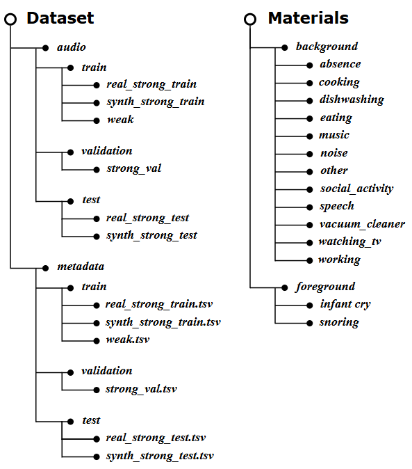

## ICSD: An Open-source Dataset for Infant Cry and Snoring Detection
[](https://arxiv.org/pdf/2408.10561) 
[](https://huggingface.co/datasets/QingyuLiu1/ICSD) 

This is the official repository for the **ICSD** dataset. 

## About ⭐️
🎤 **ICSD** is a comprehensive audio event dataset for infant cry and snoring detection with the following features:
- containing over *3.3* hours of strongly labeled data and *1* hour of weakly labeled data;
- containing foreground events and background events for generating synthetic data

The figure below shows the organized structure of the ICSD dataset where audio files are stored in the audio folder and event time-stamp annotations in the metadata folder, each further categorized into train, validation, and test subfolders. Moreover, source materials for generating synthetic strongly labeled data are also provided. You can use *[Scaper](https://github.com/justinsalamon/scaper)* to generate your own synthetic data.

<div align=center>
  
</div>
  
Detailed description for the dataset could be found in our [paper]().

*To use the ICSD dataset, you can download the audio files and metada from our provided source URL list on [HuggingFace](https://huggingface.co/datasets/QingyuLiu1/ICSD).*

*Please note that ICSD doesn't own the copyright of the audios; the copyright remains with the original owners of the video or audio.*

**Please note that our paper is currently under review. We will make all data publicly available once the paper is accepted.**

<!-- This following README will introduce the usage guide of the corresponded code. -->

## Data Preview 🔍
The demo folder provides four audio samples that you can download and listen to.

## Baseline system 🖥️
> We designed our baseline system based on DCASE 2023 Challenge task4
### Requirements 📝
The script `conda_create_environment.sh` is available to create an environment which runs the baseline system.

### Data Download ⬇️
Download the dataset from [HuggingFace](https://huggingface.co/datasets/QingyuLiu1/ICSD) and decompress it under the `data` folder

### Training 👨‍💻
Three baselines are provided:
- baseline with only *synthetic* data
- baseline with *real* data and *synthetic* data
- baseline using *pre-trained* embedding

#### 1. Baseline with only *synthetic* data
The baseline using the synthetic strongly labeled data can be run from scratch using the following command:

`python train_sed.py`

We provide a [pretrained checkpoint](https://huggingface.co/datasets/QingyuLiu1/ICSD). The baseline can be tested on the test set of the dataset using the following command:

`python train_sed.py --test_from_checkpoint /path/to/synth_only.ckpt`

#### 2. Baseline with *real* data and *synthetic* data
The baseline using the real strongly labeled data and synthetic data can be run from scratch using the following command:

`python train_sed.py --strong_real`

The command will automatically considered the strong labeled data in the training process.

We provide a [pretrained checkpoint](https://huggingface.co/datasets/QingyuLiu1/ICSD). The baseline can be tested on the test set of the dataset using the following command:

`python train_sed.py --test_from_checkpoint /path/to/hybrid.ckpt`

#### 3. Baseline using *pre-trained* embedding
We added a baseline which exploits the pre-trained model [BEATs](https://arxiv.org/abs/2212.09058). It's an iterative self-supervised learning model designed to extract high-level non-speech audio semantics. The BEATs feature representations are integrated with the CNN output through a linear transformation and layer normalization, providing additional complementary information that can enhance sound event detection performance.

To run this system, you should first pre-compute the embeddings using the following command: `python extract_embeddings.py --output_dir ./embeddings --pretrained_model "beats"`
Then, use the following command to run the system:
`train_pretrained.py`

We provide a [pretrained checkpoint](https://huggingface.co/datasets/QingyuLiu1/ICSD). The baseline can be tested on the test set of the dataset using the following command:

`python train_pretrained.py --test_from_checkpoint /path/to/BEATS.ckpt`

## Acknowledgement 🔔
We acknowledge the wonderful work by these excellent developers!
- Audioset: [agkphysics/AudioSet](https://huggingface.co/datasets/agkphysics/AudioSet)
- Baby Chillanto Database
- Donate A Cry: [gveres/donateacry-corpus](https://github.com/gveres/donateacry-corpus)
- Female and Male Snoring: [orannahum/female-and-male-snoring](https://www.kaggle.com/datasets/orannahum/female-and-male-snoring)
- Snoring: [tareqkhanemu/snoring](https://www.kaggle.com/datasets/tareqkhanemu/snoring)
- ESC-50: [karolpiczak/ESC-50](https://github.com/karolpiczak/ESC-50)
- SINS: [KULeuvenADVISE/SINS_database](https://github.com/KULeuvenADVISE/SINS_database)
- MUSAN: [MUSAN-openslr.org](https://www.openslr.org/17/)
- Scaper: [justinsalamon/scaper](https://github.com/justinsalamon/scaper)


## Reference 📖
If you use the ICSD dataset, please cite the following papers:
```bibtex
@article{ICSD,
      title={ICSD: An Open-source Dataset for Infant Cry and Snoring Detection},
      author={Qingyu Liu, Longfei Song, Dongxing Xu, Yanhua Long},
      journal={arXiv},
      volume={abs/2408.10561}
      year={2024}
}
```
