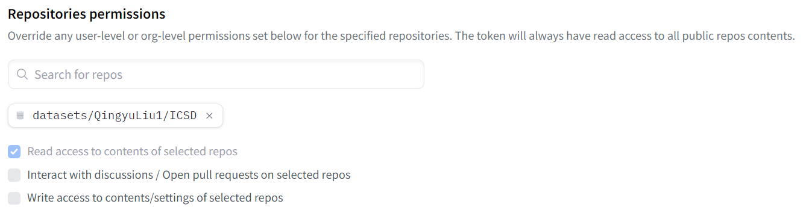

### Data Download ⬇️
You can download the ICSD dataset using the script: `download_ICSD.py`

#### Usage:
1. Visit our [Hugging Face repository](https://huggingface.co/datasets/QingyuLiu1/ICSD) to request access permissions. After the review process, you will receive authorization to download the ICSD dataset.
2. After obtaining permission, Navigate to [your Hugging Face settings](https://huggingface.co/settings/tokens) to generate your personal token. Under 'Repositories permissions', enter `datasets/QingyuLiu1/ICSD`. For detailed information about tokens, please refer to [the official documentation](https://huggingface.co/docs/hub/security-tokens).

  

3. Run the command `python download_ICSD.py --token=your_token`.  Here, `your_token` is the one you've generated from [your Hugging Face settings](https://huggingface.co/settings/tokens). Following this, the ICSD dataset will be downloaded into the `data` folder and automatically unzipped.
   > If the script `download_ICSD.py` cannot run due to network issues, you can manually download the Dataset.zip from [Hugging Face](https://huggingface.co/datasets/QingyuLiu1/ICSD) and unzip it into the `data` folder.

4. In addition to the well-organized dataset, we also provide source materials for generating synthetic strongly labeled data. You can download these by running the command `python download_ICSD.py --token=your_token --file_name=Materials.zip --local_dir=your_folder`.
